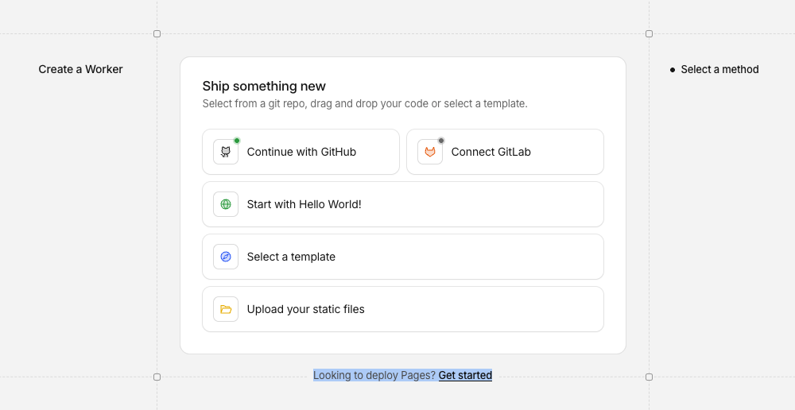
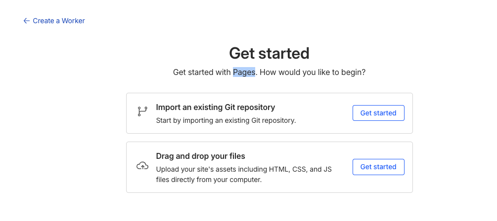
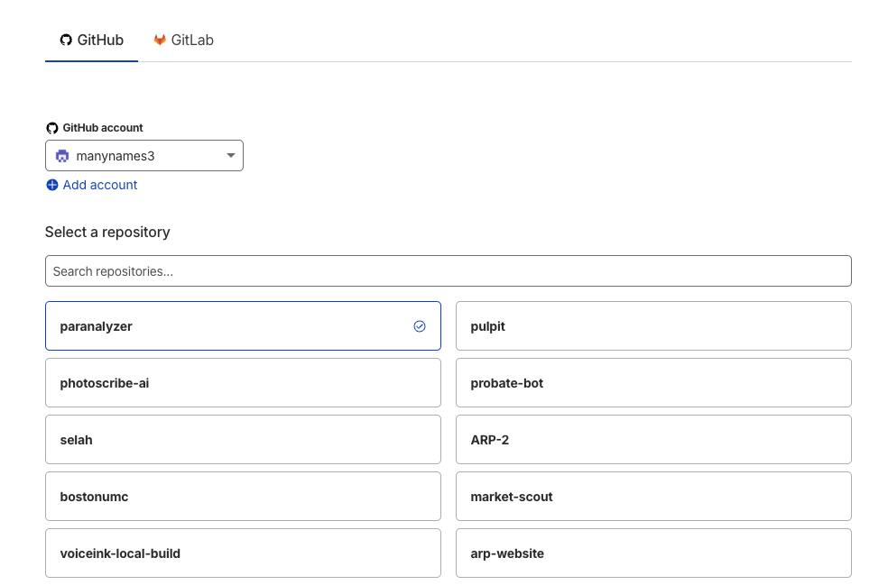
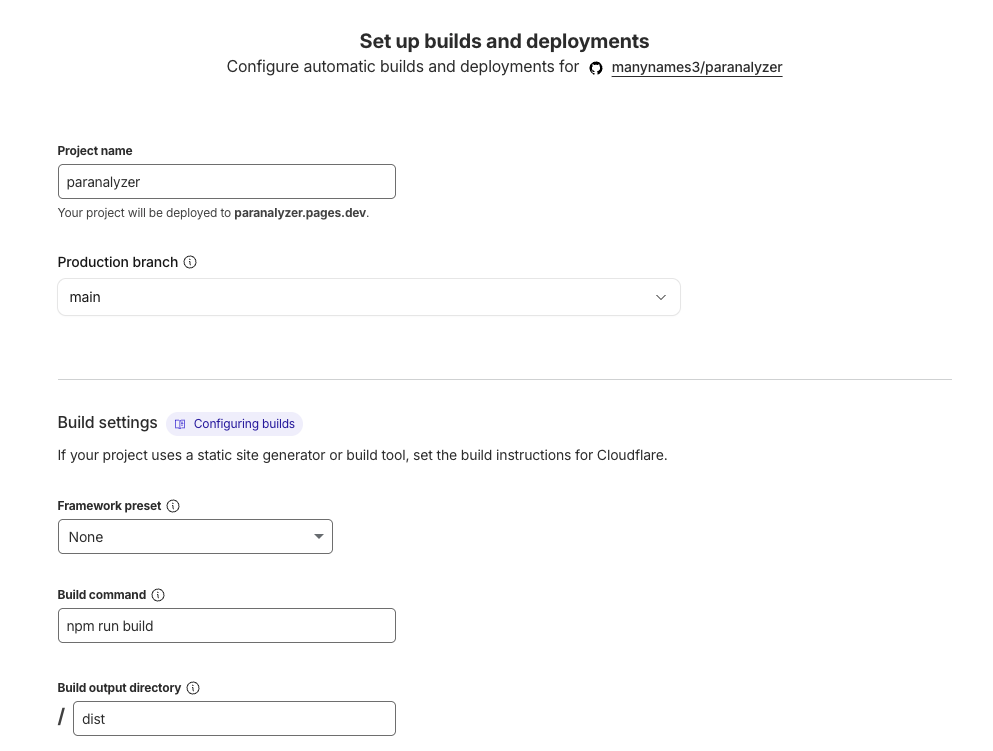
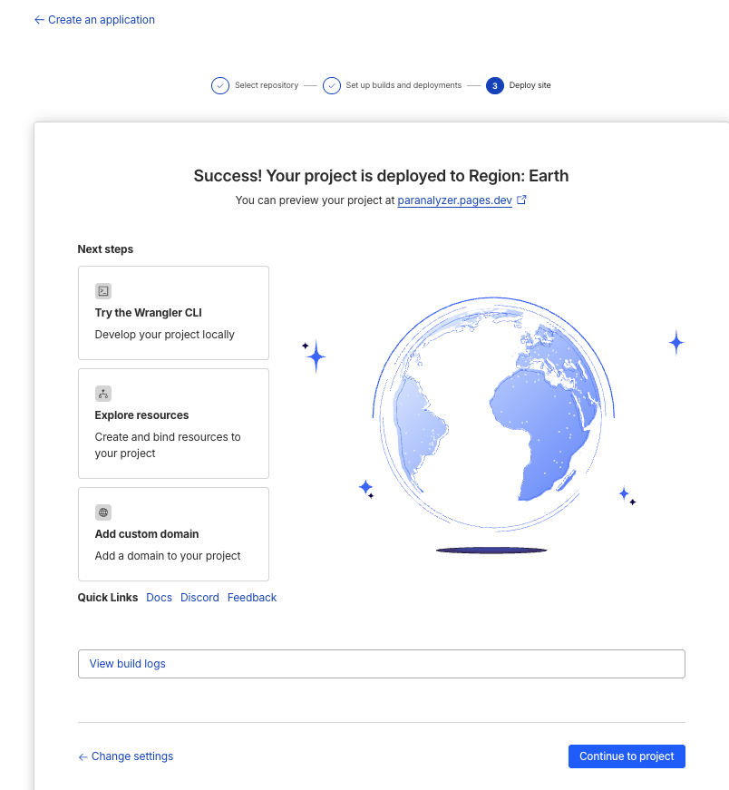

# 🏠 Paranalyzer

**Advanced real estate investment analysis and market intelligence**

Paranalyzer is a high-performance web app built for real estate investors and sales professionals who need fast, reliable property analysis and market insight. It goes beyond spreadsheets by combining AI-powered deal analysis with real-time market data in a modern, responsive interface.

## 🚀 Features

### DealCheck AI
Instantly evaluate flip and rental opportunities using AI-driven analysis based on current market conditions and property metrics.

### Zillow Market Heat Index
Track market competitiveness and inventory trends with a visual heat index powered by Zillow data.

### Professional Financial Modeling
Run advanced investment calculations including:

- ROI
- IRR
- Cash-on-cash return

Built to support more complex residential deal structures and development scenarios.

### Market Data Caching
Improve speed and reliability with integrated Supabase caching for fast market data retrieval and smoother user experience.

## 🛠 Tech Stack

Paranalyzer is built with a modern, type-safe frontend stack:

- **Framework:** React + Vite
- **Language:** TypeScript
- **Styling:** Tailwind CSS + shadcn/ui
- **Backend / Database:** Supabase (PostgreSQL)
- **Package Manager:** npm or Bun

## 🧑‍💻 Local Development

### 1. Clone the repository

```bash
git clone https://github.com/manynames3/paranalyzer.git
cd paranalyzer
```

### 2. Install dependencies

```bash
npm install
```

### 3. Set up environment variables

Create a `.env` file in the project root and add your credentials:

```env
VITE_SUPABASE_URL=your_project_url
VITE_SUPABASE_PUBLISHABLE_KEY=your_publishable_key
```

### 4. Start the development server

```bash
npm run dev
```

## 🌐 Deployment

This project is a good fit for **Cloudflare Pages** with **Supabase** as the backend.

- **Build command:** `npm run build`
- **Publish directory:** `dist`

### Cloudflare Pages setup

1. Push this repository to GitHub.
2. In Cloudflare Pages, create a new project and connect the GitHub repository.
3. Use these build settings:
   - Framework preset: `Vite`
   - Build command: `npm run build`
   - Build output directory: `dist`
4. Add these environment variables in Cloudflare Pages:
   - `VITE_SUPABASE_URL`
   - `VITE_SUPABASE_PUBLISHABLE_KEY`
5. Deploy.

### Cloudflare gotcha: Pages vs Worker

Cloudflare bundles **Workers** and **Pages** into the same dashboard tab. That makes it easy to start in the wrong flow.

For this app, you want **Pages**, not **Worker**.

If you are on the wrong screen, Cloudflare will show a Worker-first setup and hide the Pages path in a small footer link:



The correct switch is the small line at the bottom:

- `Looking to deploy Pages? Get started`

If you chose the correct option, the next screen should say:

- `Get started with Pages. How would you like to begin?`



From there, the expected flow is:

1. Import the existing Git repository.
2. Select `manynames3/paranalyzer`.
3. Use `npm run build` and `dist`.
4. Deploy to `*.pages.dev`.







### Supabase settings for the deployed site

After your first deploy, add the Cloudflare Pages URL to your Supabase project:

1. In Supabase, open `Authentication` -> `URL Configuration`.
2. Set the site URL to your production domain.
3. Add your Cloudflare Pages production URL and preview URL patterns to the additional redirect URLs list.

This app uses client-side routing, so the included [`public/_redirects`](/Users/aiden/Documents/Codex/2026-04-27/https-github-com-manynames3-paranalyzer-is/repo/public/_redirects) file is required for direct loads on routes like `/dashboard`, `/analyze`, and `/auth`.

### What stays on Supabase

Cloudflare Pages only hosts the frontend bundle. These app features still run through Supabase:

- authentication
- Postgres data storage
- saved deals
- edge functions for market data and AI summaries

## 📌 Notes

Paranalyzer is part of a professional real estate analysis toolkit. For licensing, partnerships, or custom development inquiries, please contact the repository owner.
